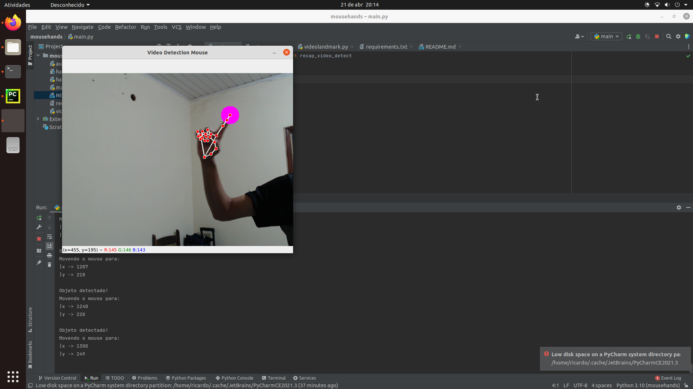

### MouseHand
Detector de movimento da mão capaz de mover o mouse, enquanto captura imagem em tempo real.

Automação Gui desktop + 
rastreamento de objetos.


OBS: Certifique-se de conectar a webcam antes de testar.

### Inicio rápido
Instale executando o comando no terminal:
```commandline
pip install -r requirements.txt
```

Depois execute o projeto:

```commandline
python main.py
```

screenshot da execução:

